# AI-Powered Parametric Income Protection for Gig Workers

An intelligent parametric insurance platform designed to protect gig economy workers from income disruptions caused by external factors beyond their control. Built specifically for India's growing delivery workforce, providing automated, transparent, and affordable financial protection.

---

## Table of Contents

1. [Problem & Worker Statistics](#1-problem--worker-statistics)
2. [Persona Scenario](#2-persona-scenario)
3. [Workflow](#3-workflow)
4. [Weekly Pricing Model](#4-weekly-pricing-model)
5. [Parametric Triggers](#5-parametric-triggers)
6. [AI Integration](#6-ai-integration)
7. [Adversarial Defense & Anti-Spoofing Strategy](#7-adversarial-defense--anti-spoofing-strategy)
8. [Tech Stack](#8-tech-stack)
9. [Development Roadmap](#9-development-roadmap)
10. [Wireframes](#10-wireframes)
11. [Sources](#sources)

---

## 1. Problem & Worker Statistics

### Our Goal

FairRoute protects gig workers from sudden income shocks by turning disruption data into fast, automatic payouts. Instead of waiting for manual claims, workers receive support when verified external events reduce their earning ability.

### How FairRoute Is Different

- **Built for short-term income loss:** Most insurance products focus on health, life, or assets. FairRoute is designed specifically for daily earning interruptions.
- **Parametric and automatic:** Payouts are triggered by validated conditions (weather, demand collapse, zone restrictions), not long claim paperwork.
- **Weekly micro-pricing:** Low weekly premiums fit gig worker cash flows better than traditional monthly or annual plans.
- **AI-driven and transparent:** Risk scoring, trigger validation, and payout logic are data-backed and visible to workers.

### Why It Is Better

FairRoute is faster, fairer, and more practical for delivery workers because it aligns with how they actually work: high-frequency shifts, variable earnings, and urgent need for liquidity during disruptions.

---

## 2. Persona Scenario

### Meet Ramesh: A Swiggy Delivery Partner

```
┌─────────────────────────────────────────────────────────────────────┐
│  WORKER PROFILE                                                     │
├─────────────────────────────────────────────────────────────────────┤
│  Name: Ramesh Kumar                                                 │
│  Age: 28 years                                                      │
│  Location: Bengaluru, Karnataka                                     │
│  Platform: Swiggy                                                   │
│  Experience: 2 years as delivery partner                            │
│  Work Type: Full-time                                               │
│  Monthly Income: ₹25,000 – ₹28,000 (gross)                          │
│  Dependents: Wife, 1 child, elderly parents                         │
└─────────────────────────────────────────────────────────────────────┘
```

### The Problem Scenario: Monsoon Day

**Date:** July 15th (Peak Monsoon Season)

**6:00 AM:** Weather forecast predicts heavy rainfall for Bengaluru.

**10:00 AM:** Ramesh logs in for his shift. It starts raining heavily.

**10:00 AM – 2:00 PM:**
- Order volume drops by 60%
- Ramesh completes only 3 deliveries instead of usual 8
- Earnings: ₹120 (vs. usual ₹400)

**2:00 PM – 5:00 PM:**
- Rainfall intensifies, urban flooding in some areas
- Platform demand drops further
- Ramesh waits 2+ hours between orders
- Earnings: ₹60 (vs. usual ₹200)

**5:00 PM – 10:00 PM:**
- Rain continues, peak hour orders significantly reduced
- Completes only 5 deliveries instead of usual 15
- Misses daily incentive bonus (needed 20 deliveries)
- Earnings: ₹300 (vs. usual ₹900 + ₹200 bonus)

### Financial Impact

| Metric | Normal Day | Monsoon Day | Loss |
|--------|------------|-------------|------|
| Deliveries Completed | 28 | 8 | 20 orders |
| Base Earnings | ₹1,500 | ₹480 | ₹1,020 |
| Incentive Bonus | ₹200 | ₹0 | ₹200 |
| **Total Daily Loss** | - | - | **₹1,220** |

### The Emotional Reality

> *"I was online for 12 hours. I wanted to work. The orders just didn't come. But my rent is still due. My child's school fees don't wait for the rain to stop."*
> — Ramesh

### How FairRoute Helps Ramesh

**With FairRoute Coverage:**

```
┌─────────────────────────────────────────────────────────────────────┐
│  FAIRROUTE PAYOUT TRIGGERED                                         │
├─────────────────────────────────────────────────────────────────────┤
│  Trigger: Heavy Rainfall (>50mm in 24 hours in delivery zone)       │
│  Verification: IMD Weather Data + Platform Order Volume Drop        │
│  Eligibility: Active policy, logged into platform during event      │
│                                                                     │
│  PAYOUT CALCULATION:                                                │
│  ├─ Lost working hours: 8 hours (verified via platform data)        │
│  ├─ Hourly compensation rate: ₹100/hour                             │
│  ├─ Weather multiplier: 1.2x (heavy rainfall category)              │
│  └─ Total Payout: ₹960                                              │
│                                                                     │
│  PAYOUT STATUS: Auto-credited to Ramesh's wallet within 2 hours     │
└─────────────────────────────────────────────────────────────────────┘
```

**Ramesh's Day with FairRoute:**

| Metric | Without FairRoute | With FairRoute |
|--------|-------------------|----------------|
| Platform Earnings | ₹480 | ₹480 |
| Insurance Payout | ₹0 | ₹960 |
| **Total Income** | **₹480** | **₹1,440** |
| Weekly Premium Paid | - | ₹69 |

---

## 3. Workflow

### End-to-End System Flow

```
┌──────────────────────────────────────────────────────────────────────────────┐
│                           FAIRROUTE WORKFLOW                                  │
└──────────────────────────────────────────────────────────────────────────────┘

┌─────────────┐     ┌─────────────┐     ┌─────────────┐     ┌─────────────┐
│   WORKER    │     │  PLATFORM   │     │   FAIRROUTE │     │   PAYOUT    │
│ ONBOARDING  │────▶│    DATA     │────▶│  AI ENGINE  │────▶│   ENGINE    │
└─────────────┘     └─────────────┘     └─────────────┘     └─────────────┘
      │                   │                   │                   │
      ▼                   ▼                   ▼                   ▼
┌─────────────┐     ┌─────────────┐     ┌─────────────┐     ┌─────────────┐
│ • Register  │     │ • Work hrs  │     │ • Analyze   │     │ • Calculate │
│ • KYC       │     │ • Earnings  │     │ • Predict   │     │ • Verify    │
│ • Plan      │     │ • Location  │     │ • Trigger   │     │ • Transfer  │
│ • Payment   │     │ • Activity  │     │ • Validate  │     │ • Notify    │
└─────────────┘     └─────────────┘     └─────────────┘     └─────────────┘
```

### Detailed Workflow Stages

#### Stage 1: Worker Onboarding

```
┌────────────────────────────────────────────────────────────────┐
│                    ONBOARDING FLOW                             │
├────────────────────────────────────────────────────────────────┤
│                                                                │
│  1. REGISTRATION                                               │
│     ├─ Mobile number verification (OTP)                        │
│     ├─ Basic profile creation                                  │
│     └─ Platform account linking (Swiggy)                       │
│                                                                │
│  2. KYC VERIFICATION                                           │
│     ├─ Aadhaar verification (DigiLocker API)                   │
│     ├─ PAN verification (optional, for tax purposes)           │
│     └─ Bank account linking (UPI/Account details)              │
│                                                                │
│  3. WORK HISTORY SYNC                                          │
│     ├─ Connect delivery platform account                       │
│     ├─ Import last 30 days work history                        │
│     └─ Calculate baseline earning patterns                     │
│                                                                │
│  4. PLAN SELECTION                                             │
│     ├─ View available coverage tiers                           │
│     ├─ AI-recommended plan based on work patterns              │
│     └─ Select and confirm coverage                             │
│                                                                │
│  5. PAYMENT SETUP                                              │
│     ├─ Choose payment method (UPI/Auto-deduct)                 │
│     ├─ Weekly premium auto-deduction authorization             │
│     └─ First premium payment                                   │
│                                                                │
│  ✓ COVERAGE ACTIVE                                             │
│                                                                │
└────────────────────────────────────────────────────────────────┘
```

#### Stage 2: Continuous Monitoring

```
┌────────────────────────────────────────────────────────────────┐
│                 REAL-TIME MONITORING                           │
├────────────────────────────────────────────────────────────────┤
│                                                                │
│  DATA SOURCES                   MONITORING PARAMETERS          │
│  ─────────────                  ─────────────────────          │
│                                                                │
│  Weather APIs ─────────────────▶ Temperature                   │
│  (IMD, OpenWeather)              Rainfall (mm/hour)            │
│                                  Humidity levels               │
│                                  Air quality index             │
│                                                                │
│  Platform APIs ────────────────▶ Order volume (zone-wise)      │
│  (Partner data feed)             Active delivery partners      │
│                                  Average delivery time         │
│                                  Surge pricing status          │
│                                                                │
│  Government APIs ──────────────▶ Curfew notifications          │
│  (Disaster mgmt)                 Zone restrictions             │
│                                  Emergency alerts              │
│                                                                │
│  Worker App ───────────────────▶ Login status                  │
│  (FairRoute)                     GPS location                  │
│                                  Active/idle time              │
│                                                                │
└────────────────────────────────────────────────────────────────┘
```

#### Stage 3: Trigger Detection & Validation

```
┌────────────────────────────────────────────────────────────────┐
│              TRIGGER DETECTION WORKFLOW                        │
├────────────────────────────────────────────────────────────────┤
│                                                                │
│  ┌──────────────┐                                              │
│  │ Event        │                                              │
│  │ Detected     │                                              │
│  └──────┬───────┘                                              │
│         │                                                      │
│         ▼                                                      │
│  ┌──────────────┐     ┌──────────────┐                         │
│  │ Threshold    │────▶│ Multi-source │                         │
│  │ Check        │ YES │ Validation   │                         │
│  └──────┬───────┘     └──────┬───────┘                         │
│         │ NO                 │                                 │
│         ▼                    ▼                                 │
│  ┌──────────────┐     ┌──────────────┐     ┌──────────────┐    │
│  │ Continue     │     │ Worker       │────▶│ Trigger      │    │
│  │ Monitoring   │     │ Eligibility  │ YES │ Confirmed    │    │
│  └──────────────┘     └──────┬───────┘     └──────┬───────┘    │
│                              │ NO                 │            │
│                              ▼                    ▼            │
│                       ┌──────────────┐     ┌──────────────┐    │
│                       │ Log & Skip   │     │ Initiate     │    │
│                       │ (No payout)  │     │ Payout       │    │
│                       └──────────────┘     └──────────────┘    │
│                                                                │
└────────────────────────────────────────────────────────────────┘
```

#### Stage 4: Payout Processing

```
┌────────────────────────────────────────────────────────────────┐
│                  PAYOUT WORKFLOW                               │
├────────────────────────────────────────────────────────────────┤
│                                                                │
│  TRIGGER CONFIRMED                                             │
│         │                                                      │
│         ▼                                                      │
│  ┌──────────────────────────────────────────────────┐          │
│  │ PAYOUT CALCULATION                               │          │
│  │                                                  │          │
│  │ Base Amount = (Lost Hours) × (Hourly Rate)      │          │
│  │ Multiplier = Event Severity Factor              │          │
│  │ Cap = Maximum daily/weekly payout limit         │          │
│  │                                                  │          │
│  │ Final Payout = min(Base × Multiplier, Cap)      │          │
│  └──────────────────────────────────────────────────┘          │
│         │                                                      │
│         ▼                                                      │
│  ┌──────────────────────────────────────────────────┐          │
│  │ VERIFICATION                                     │          │
│  │                                                  │          │
│  │ ✓ Policy active                                  │          │
│  │ ✓ Premium current                                │          │
│  │ ✓ Within coverage limits                         │          │
│  │ ✓ No duplicate claims                            │          │
│  └──────────────────────────────────────────────────┘          │
│         │                                                      │
│         ▼                                                      │
│  ┌──────────────────────────────────────────────────┐          │
│  │ TRANSFER                                         │          │
│  │                                                  │          │
│  │ Method: UPI / Bank Transfer                      │          │
│  │ Timeline: Within 2 hours of trigger confirmation │          │
│  │ Notification: SMS + App push notification        │          │
│  └──────────────────────────────────────────────────┘          │
│                                                                │
└────────────────────────────────────────────────────────────────┘
```

---

## 4. Weekly Pricing Model

### Pricing Philosophy

FairRoute uses a **weekly micro-premium model** designed specifically for gig workers:

- **Affordable:** Small weekly payments instead of large monthly premiums
- **Flexible:** Skip weeks without penalty during low-work periods
- **Proportional:** Coverage scales with work intensity and risk exposure

### Coverage Tiers

```
┌─────────────────────────────────────────────────────────────────────────────┐
│                         FAIRROUTE PRICING TIERS                             │
├─────────────────────────────────────────────────────────────────────────────┤
│                                                                             │
│  ┌─────────────────┐   ┌─────────────────┐   ┌─────────────────┐           │
│  │    BASIC        │   │   STANDARD      │   │    PREMIUM      │           │
│  │    SHIELD       │   │   SHIELD        │   │    SHIELD       │           │
│  ├─────────────────┤   ├─────────────────┤   ├─────────────────┤           │
│  │                 │   │                 │   │                 │           │
│  │  ₹49/week       │   │  ₹69/week       │   │  ₹99/week       │           │
│  │                 │   │                 │   │                 │           │
│  │  Max Payout:    │   │  Max Payout:    │   │  Max Payout:    │           │
│  │  ₹500/day       │   │  ₹800/day       │   │  ₹1,200/day     │           │
│  │  ₹2,000/week    │   │  ₹3,500/week    │   │  ₹6,000/week    │           │
│  │                 │   │                 │   │                 │           │
│  │  Triggers:      │   │  Triggers:      │   │  Triggers:      │           │
│  │  • Weather      │   │  • Weather      │   │  • Weather      │           │
│  │  • Zone shutdown│   │  • Zone shutdown│   │  • Zone shutdown│           │
│  │                 │   │  • Demand drops │   │  • Demand drops │           │
│  │                 │   │                 │   │  • Heat alerts  │           │
│  │                 │   │                 │   │  • Platform     │           │
│  │                 │   │                 │   │    outages      │           │
│  │                 │   │                 │   │                 │           │
│  │  RECOMMENDED    │   │  MOST POPULAR   │   │  FULL-TIME      │           │
│  │  Part-time      │   │  Regular        │   │  Heavy users    │           │
│  │  workers        │   │  workers        │   │                 │           │
│  └─────────────────┘   └─────────────────┘   └─────────────────┘           │
│                                                                             │
└─────────────────────────────────────────────────────────────────────────────┘
```

### Payout Calculation Formula

```
┌─────────────────────────────────────────────────────────────────┐
│                    PAYOUT FORMULA                               │
├─────────────────────────────────────────────────────────────────┤
│                                                                 │
│  PAYOUT = min(                                                  │
│              (LOST_HOURS × HOURLY_RATE × SEVERITY_MULTIPLIER),  │
│              DAILY_CAP                                          │
│           )                                                     │
│                                                                 │
│  Where:                                                         │
│  ─────────────────────────────────────────────                  │
│  LOST_HOURS = Verified inactive hours during trigger event      │
│  HOURLY_RATE = Based on coverage tier (₹75/₹100/₹150)           │
│  SEVERITY_MULTIPLIER = 1.0x to 1.5x based on event intensity    │
│  DAILY_CAP = Maximum daily payout per tier                      │
│                                                                 │
│  SEVERITY MULTIPLIERS:                                          │
│  ├─ Light disruption (20-40% demand drop): 1.0x                 │
│  ├─ Moderate disruption (40-60% demand drop): 1.2x              │
│  └─ Severe disruption (>60% demand drop): 1.5x                  │
│                                                                 │
└─────────────────────────────────────────────────────────────────┘
```

### Example Payout Calculations

**Example 1: Standard Shield - Heavy Rain**
```
Lost Hours: 6 hours
Hourly Rate: ₹100
Severity: Moderate (1.2x multiplier)
Calculation: 6 × ₹100 × 1.2 = ₹720
Daily Cap: ₹800
Final Payout: ₹720 ✓
```

**Example 2: Basic Shield - Zone Shutdown**
```
Lost Hours: 10 hours
Hourly Rate: ₹75
Severity: Severe (1.5x multiplier)
Calculation: 10 × ₹75 × 1.5 = ₹1,125
Daily Cap: ₹500
Final Payout: ₹500 (capped) ✓
```

**Example 3: Premium Shield - Heatwave**
```
Lost Hours: 8 hours
Hourly Rate: ₹150
Severity: Severe (1.5x multiplier)
Calculation: 8 × ₹150 × 1.5 = ₹1,800
Daily Cap: ₹1,200
Final Payout: ₹1,200 (capped) ✓
```

---

## 5. Parametric Triggers

### FairRoute Trigger Categories

#### 1. Weather-Based Triggers

| Trigger | Threshold | Data Source | Payout Activation |
|---------|-----------|-------------|-------------------|
| Heavy Rainfall | >30mm in 3 hours | IMD API | Automatic |
| Extreme Heat | >42°C sustained | Weather stations | Automatic |
| Urban Flooding | Water logging reported | Municipal + satellite | Automatic |
| Poor Visibility | <100m visibility | Aviation weather | Automatic |
| Cyclone Alert | IMD Orange/Red alert | IMD warnings | Automatic |

#### 2. Platform-Based Triggers

| Trigger | Threshold | Data Source | Payout Activation |
|---------|-----------|-------------|-------------------|
| Demand Drop | >40% below zone average | Platform API | Automatic |
| Order Allocation Pause | <2 orders in 3 hours (while active) | Platform data | Automatic |
| Platform Outage | System-wide service disruption | Platform status | Automatic |
| Zone Restriction | Geographic delivery restrictions | Platform announcements | Automatic |

#### 3. External Event Triggers

| Trigger | Condition | Data Source | Payout Activation |
|---------|-----------|-------------|-------------------|
| Government Curfew | Official curfew announcement | Govt notifications | Automatic |
| Civil Disturbance | Area safety restrictions | News + official sources | Verified |
| Infrastructure Failure | Major road/transport disruption | Traffic authorities | Verified |
| Public Health Emergency | Health-related restrictions | Health department | Automatic |

### Trigger Validation Process

```
┌─────────────────────────────────────────────────────────────────┐
│               MULTI-SOURCE VALIDATION                           │
├─────────────────────────────────────────────────────────────────┤
│                                                                 │
│  For a trigger to be CONFIRMED, it must pass:                   │
│                                                                 │
│  ┌─────────────────────────────────────────────────────────┐    │
│  │ 1. PRIMARY SOURCE VERIFICATION                          │    │
│  │    └─ Official data confirms threshold breach           │    │
│  └─────────────────────────────────────────────────────────┘    │
│                          │                                      │
│                          ▼                                      │
│  ┌─────────────────────────────────────────────────────────┐    │
│  │ 2. SECONDARY SOURCE CORRELATION                         │    │
│  │    └─ At least one additional source confirms event     │    │
│  └─────────────────────────────────────────────────────────┘    │
│                          │                                      │
│                          ▼                                      │
│  ┌─────────────────────────────────────────────────────────┐    │
│  │ 3. PLATFORM IMPACT VERIFICATION                         │    │
│  │    └─ Delivery platform data shows operational impact   │    │
│  └─────────────────────────────────────────────────────────┘    │
│                          │                                      │
│                          ▼                                      │
│  ┌─────────────────────────────────────────────────────────┐    │
│  │ 4. WORKER ACTIVITY CHECK                                │    │
│  │    └─ Worker was active/logged in during trigger event  │    │
│  └─────────────────────────────────────────────────────────┘    │
│                          │                                      │
│                          ▼                                      │
│                  TRIGGER CONFIRMED ✓                            │
│                                                                 │
└─────────────────────────────────────────────────────────────────┘
```

### Trigger Transparency

Workers can view trigger status in real-time:

| Information | Visibility |
|-------------|------------|
| Active triggers in zone | Real-time in app |
| Trigger threshold details | Available in policy |
| Data sources used | Displayed per trigger |
| Payout calculation | Shown before confirmation |

---

## 6. AI Integration

### Technical Stack & Infrastructure

| Component | Technology | Why This Choice |
|-----------|-----------|-----------------|
| ML Framework | Python + scikit-learn + XGBoost | Production-proven, lightweight, runs on a single $5/mo VPS at launch scale |
| Weather Model | Facebook Prophet (time-series) | Handles seasonality + holidays natively, ideal for Indian monsoon cycles |
| Anomaly Detection | Isolation Forest (scikit-learn) | Works on unlabeled data — critical at launch when no historical claims exist |
| NLP / Chatbot | Gemini 2.0 Flash + Google Cloud STT/TTS | Flash handles multilingual replies with full context; STT/TTS for voice |
| Model Serving | FastAPI | Lightweight Python API server; in-memory caching for weather scores (no Redis needed at launch) |
| Scheduling | APScheduler (in-process) | Runs periodic jobs (weather polling, zone scoring) inside the FastAPI process — no separate broker needed until 10K+ workers |
| Monitoring | Python `logging` + GCP Cloud Logging | Structured JSON logs with alerts on error spikes; Grafana/Prometheus added only when ops team exists |

### AI Architecture (Realistic)

```
┌─────────────────────────────────────────────────────────────────────────────┐
│                         FAIRROUTE AI PIPELINE                               │
├─────────────────────────────────────────────────────────────────────────────┤
│                                                                             │
│  DATA INGESTION (APScheduler periodic jobs)                                  │
│  ┌─────────────┐  ┌─────────────┐  ┌─────────────┐  ┌─────────────┐        │
│  │ IMD RSS Feed│  │ OpenWeather │  │ Google Maps │  │ Worker App  │        │
│  │ (scrape     │  │ API (free   │  │ Routes API  │  │ GPS + idle  │        │
│  │  every 15m) │  │  tier: 1K   │  │ (congestion │  │  events via │        │
│  │             │  │  calls/day) │  │  data)      │  │  Firebase)  │        │
│  └──────┬──────┘  └──────┬──────┘  └──────┬──────┘  └──────┬──────┘        │
│         │                │                │                │               │
│         └────────────────┴────────────────┴────────────────┘               │
│                                   │                                         │
│                                   ▼                                         │
│                    ┌──────────────────────────┐                              │
│                    │  PostgreSQL (raw_events   │                              │
│                    │  + in-memory score cache) │                              │
│                    └─────────────┬────────────┘                              │
│                                 │                                           │
│              ┌──────────────────┼──────────────────┐                        │
│              │                  │                  │                        │
│              ▼                  ▼                  ▼                        │
│  ┌─────────────────┐ ┌─────────────────┐ ┌─────────────────┐               │
│  │ WEATHER RISK    │ │ ZONE ACTIVITY   │ │ PLAN            │               │
│  │ SCORER          │ │ SCORER          │ │ RECOMMENDER     │               │
│  │ (Prophet +      │ │ (Isolation      │ │ (XGBoost        │               │
│  │  XGBoost)       │ │  Forest)        │ │  classifier)    │               │
│  └────────┬────────┘ └────────┬────────┘ └────────┬────────┘               │
│           │                   │                   │                        │
│           ▼                   ▼                   ▼                        │
│  ┌─────────────────────────────────────────────────────────────┐            │
│  │                    FastAPI SERVING LAYER                     │            │
│  │  GET /api/risk/{zone_id}        → weather + activity score  │            │
│  │  GET /api/trigger/check/{zone}  → trigger yes/no + severity │            │
│  │  POST /api/recommend-plan       → plan suggestion for user  │            │
│  │  POST /api/validate-claim       → fraud score + approve/flag│            │
│  └─────────────────────────────────────────────────────────────┘            │
│                                                                             │
└─────────────────────────────────────────────────────────────────────────────┘
```

### 1. Weather Risk Scoring (Prophet + XGBoost)

**What it actually does:** Predicts whether weather conditions in a specific zone will cross payout trigger thresholds in the next 6–24 hours.

**Model 1 — Facebook Prophet (Time-Series Forecast):**
- Trained on 3+ years of IMD historical rainfall/temperature data per city
- Handles Indian-specific seasonality: monsoon onset (June), retreating monsoon (Oct), western disturbances (Jan–Feb)
- Outputs: predicted rainfall (mm), predicted temperature (°C) for next 24h in 3-hour intervals

**Model 2 — XGBoost (Threshold Classifier):**
- Takes Prophet's forecast + real-time OpenWeather data as input
- Binary classification: will trigger threshold be breached? (yes/no + probability)
- Features used:

| Feature | Source | Update Frequency |
|---------|--------|------------------|
| Predicted rainfall (mm/3hr) | Prophet forecast | Every 3 hours |
| Current rainfall (mm) | OpenWeather API | Every 15 min |
| Humidity (%) | OpenWeather API | Every 15 min |
| Wind speed (km/h) | OpenWeather API | Every 15 min |
| Temperature (°C) | OpenWeather API | Every 15 min |
| Day of monsoon season (1-120) | Calendar derived | Daily |
| Zone flood history score | Static per zone | Monthly update |
| IMD warning level (0/1/2/3) | IMD RSS scrape | Every 15 min |

**Training Data:** IMD open data archives (2019–2025) mapped against known disruption events per city. Exact sample count depends on city and event frequency — Bengaluru and Mumbai have the densest records.

**Output Example:**
```
{
  "zone": "koramangala_blr",
  "timestamp": "2026-07-15T14:00:00+05:30",
  "weather_risk_score": 82,
  "predicted_rainfall_6h": 45.2,
  "trigger_probability": 0.87,
  "trigger_type": "heavy_rainfall",
  "confidence": "high",
  "model_version": "weather_v3.1"
}
```

### 2. Zone Activity Anomaly Detection (Isolation Forest)

**Why Isolation Forest?** At launch, FairRoute has zero historical claim data. Isolation Forest is an unsupervised algorithm — it learns what "normal" looks like from worker GPS/activity data and flags deviations without needing labeled examples.

**How it works in practice:**

```
┌─────────────────────────────────────────────────────────────────┐
│         ZONE ACTIVITY SCORING (runs every 30 minutes)          │
├─────────────────────────────────────────────────────────────────┤
│                                                                 │
│  Step 1: COLLECT (from FairRoute app via Firebase)              │
│  ────────────────────────────────────                           │
│  For each zone, aggregate in 30-min windows:                    │
│  • active_workers: count of workers with GPS movement > 200m    │
│  • idle_workers: count of workers stationary > 20 min           │
│  • avg_distance_covered: mean GPS distance per worker (km)      │
│  • order_count_reported: sum of manually entered orders         │
│                                                                 │
│  Step 2: FEATURE ENGINEERING                                    │
│  ──────────────────────────                                     │
│  • idle_ratio = idle_workers / (active + idle)                  │
│  • activity_vs_baseline = current avg_distance / 30-day avg     │
│  • hour_of_day (cyclical encoding: sin/cos)                     │
│  • day_of_week (one-hot)                                        │
│  • is_peak_hour (binary: 1 if 6–10 PM)                          │
│                                                                 │
│  Step 3: SCORE (Isolation Forest, scikit-learn)                 │
│  ─────────────────────────────────────────                      │
│  • contamination=0.05 (expect ~5% of windows to be anomalous)  │
│  • Anomaly score: -1 (anomaly) to +1 (normal)                  │
│  • Score < -0.3 → potential demand disruption                   │
│  • Score < -0.6 → strong disruption signal                      │
│                                                                 │
│  Step 4: CROSS-VALIDATE with weather score                      │
│  ──────────────────────────────────────────                     │
│  • If anomaly_score < -0.3 AND weather_risk > 60 → TRIGGER     │
│  • If anomaly_score < -0.6 alone → flag for manual review       │
│  • If only weather_risk > 80 → pre-alert (no payout yet)       │
│                                                                 │
└─────────────────────────────────────────────────────────────────┘
```

**Cold Start Problem & Solution:**

| Phase | Data Available | Strategy |
|-------|---------------|----------|
| Week 1–2 | < 50 workers/zone | Rules-only mode: triggers based purely on weather thresholds (IMD data) |
| Week 3–6 | Baseline activity forming | Isolation Forest trains on accumulating 30-min zone snapshots |
| Month 2+ | 1000+ zone snapshots | Full ML scoring active; model retrained weekly on new data |
| Month 6+ | Labeled claim outcomes | Supervised XGBoost replaces Isolation Forest for demand scoring |

### 3. Trigger Validation Pipeline

**Purpose:** Prevent false triggers by requiring multi-signal agreement before approving a payout.

```
┌─────────────────────────────────────────────────────────────────┐
│              TRIGGER VALIDATION (real-time, < 5 sec)            │
├─────────────────────────────────────────────────────────────────┤
│                                                                 │
│  Input: zone_id + trigger_type + timestamp                      │
│         │                                                       │
│         ▼                                                       │
│  ┌─────────────────────────────────────────────────────────┐    │
│  │ CHECK 1: Data Freshness                                 │    │
│  │ └─ Weather data < 30 min old? GPS data < 15 min old?    │    │
│  │    FAIL → reject trigger, log stale_data_error          │    │
│  └─────────────────────────────────────────────────────────┘    │
│         │ PASS                                                  │
│         ▼                                                       │
│  ┌─────────────────────────────────────────────────────────┐    │
│  │ CHECK 2: Threshold Breach (rule-based)                  │    │
│  │ └─ rainfall > 30mm/3hr? OR temp > 42°C? OR              │    │
│  │    govt_alert == "red"?                                  │    │
│  │    FAIL → no trigger, continue monitoring               │    │
│  └─────────────────────────────────────────────────────────┘    │
│         │ PASS                                                  │
│         ▼                                                       │
│  ┌─────────────────────────────────────────────────────────┐    │
│  │ CHECK 3: Multi-Source Agreement                         │    │
│  │ └─ At least 2 of 3 must agree:                          │    │
│  │    [IMD data] + [OpenWeather] + [worker idle ratio]     │    │
│  │    Agreement score = count(sources confirming) / 3       │    │
│  │    FAIL if agreement < 0.66                             │    │
│  └─────────────────────────────────────────────────────────┘    │
│         │ PASS                                                  │
│         ▼                                                       │
│  ┌─────────────────────────────────────────────────────────┐    │
│  │ CHECK 4: Worker Eligibility (per-worker, SQL query)     │    │
│  │ └─ Policy active? Premium paid? GPS in zone?             │    │
│  │    App session active during window?                     │    │
│  │    FAIL → worker excluded from this trigger's payout    │    │
│  └─────────────────────────────────────────────────────────┘    │
│         │ PASS                                                  │
│         ▼                                                       │
│  ┌─────────────────────────────────────────────────────────┐    │
│  │ CHECK 5: Fraud Score (see Section 6.6 below)            │    │
│  │ └─ fraud_score < 0.7? → APPROVE                         │    │
│  │    fraud_score 0.7–0.85? → APPROVE with flag            │    │
│  │    fraud_score > 0.85? → HOLD for manual review          │    │
│  └─────────────────────────────────────────────────────────┘    │
│         │                                                       │
│         ▼                                                       │
│  Output: { trigger_confirmed: true, severity: 1.2,             │
│            eligible_workers: [w_id, ...], payout_amounts: [...] }│
│                                                                 │
└─────────────────────────────────────────────────────────────────┘
```

### 4. Plan Recommendation Engine (XGBoost Classifier)

**What it does:** When a worker signs up, recommends Basic/Standard/Premium shield based on their actual risk exposure.

**Model:** XGBoost multi-class classifier (3 classes: basic, standard, premium)

**Input Features (collected during onboarding + first 7 days):**

| Feature | How It's Collected | Type |
|---------|-------------------|------|
| `city` | Registration form | Categorical |
| `primary_zone` | GPS data from first 7 days | Categorical |
| `avg_daily_hours` | App tracking (shift start/end) | Float |
| `peak_hour_ratio` | % of hours during 6–10 PM | Float (0–1) |
| `zone_flood_risk` | Pre-computed from IMD historical data | Float (0–100) |
| `zone_heat_risk` | Pre-computed from IMD historical data | Float (0–100) |
| `monsoon_month` | Binary: is current month June–Sept? | Binary |
| `self_reported_income` | Onboarding form (₹/week) | Integer |
| `self_reported_platform` | Swiggy / Zomato / Dunzo / Other | Categorical |

**Output:**
```
{
  "recommended_plan": "standard",
  "confidence": 0.78,
  "reasoning": [
    "Your zone (HSR Layout) has high monsoon flood risk (score: 74/100)",
    "You work 70% peak hours → higher disruption exposure",
    "Standard covers demand drops — relevant for your zone's pattern",
    "At ₹69/week, this is 0.2% of your reported weekly income"
  ],
  "expected_monthly_payouts": "₹1,200 – ₹1,800 (based on zone history)"
}
```

**Training:** Initially trained on synthetic data generated from IMD weather patterns × zone risk profiles × pricing tiers. Retrained monthly on actual conversion data once real users onboard.

### 5. Vernacular AI Assistant (STT → Gemini 2.0 Flash → TTS)

**Purpose:** Let workers interact with FairRoute in Hindi, Kannada, Tamil, Telugu, or Marathi — via text or voice — with a context-aware AI that understands their policy, payouts, and zone status.

**Why Gemini 2.0 Flash?** It supports Hindi and other Indian languages natively, costs ~$0.10/1M input tokens (making it ~₹0.01 per query), responds in under 1 second, and can hold full user context in a single prompt — no need for separate intent/entity extraction layers.

**Architecture:**

```
┌─────────────────────────────────────────────────────────────────┐
│           VERNACULAR AI ASSISTANT PIPELINE                      │
├─────────────────────────────────────────────────────────────────┤
│                                                                 │
│  Worker speaks/types in any supported language                   │
│         │                                                       │
│         ▼                                                       │
│  ┌─────────────────────────────────────────────────────────┐    │
│  │ STEP 1: SPEECH-TO-TEXT                                  │    │
│  │ Google Cloud Speech-to-Text API v2                      │    │
│  │ ├─ Supports: hi-IN, kn-IN, ta-IN, te-IN, mr-IN          │    │
│  │ ├─ Auto language detection (chirp_2 model)               │    │
│  │ └─ Output: transcribed text + detected_language          │    │
│  └─────────────────────────────────────────────────────────┘    │
│         │                                                       │
│         ▼                                                       │
│  ┌─────────────────────────────────────────────────────────┐    │
│  │ STEP 2: CONTEXT INJECTION (server-side)                 │    │
│  │ Before sending to Gemini, attach user-specific context: │    │
│  │ ├─ Worker profile (name, zone, plan, premium status)     │    │
│  │ ├─ Last 5 payouts (date, amount, trigger type)           │    │
│  │ ├─ Current zone risk score + active triggers             │    │
│  │ ├─ Policy details (tier, daily cap, hourly rate)         │    │
│  │ └─ System prompt with FairRoute guardrails               │    │
│  └─────────────────────────────────────────────────────────┘    │
│         │                                                       │
│         ▼                                                       │
│  ┌─────────────────────────────────────────────────────────┐    │
│  │ STEP 3: GEMINI 2.0 FLASH (via Google AI API)           │    │
│  │ ├─ Model: gemini-2.0-flash                               │    │
│  │ ├─ System prompt: "You are FairRoute assistant.          │    │
│  │ │   Reply in the worker's language. Be concise.          │    │
│  │ │   Only answer about coverage, payouts, triggers,       │    │
│  │ │   weather, and plans. Never give financial advice."     │    │
│  │ ├─ Input: system_prompt + user_context + user_query      │    │
│  │ ├─ Max output tokens: 200 (keeps responses short)        │    │
│  │ └─ Output: reply text in worker's detected language      │    │
│  └─────────────────────────────────────────────────────────┘    │
│         │                                                       │
│         ▼                                                       │
│  ┌─────────────────────────────────────────────────────────┐    │
│  │ STEP 4: TEXT-TO-SPEECH                                  │    │
│  │ Google Cloud TTS (WaveNet voices)                       │    │
│  │ ├─ Voice: language-matched (hi-IN-Wavenet-A, etc.)       │    │
│  │ ├─ Speaking rate: 0.9x (slightly slower for clarity)     │    │
│  │ └─ Output: audio stream played in-app                    │    │
│  └─────────────────────────────────────────────────────────┘    │
│                                                                 │
└─────────────────────────────────────────────────────────────────┘
```

**Example Conversations:**

| Worker Says (Hindi) | Context Injected | Gemini Response |
|---------------------|-----------------|-----------------|
| "मेरा प्लान क्या है?" | `plan: standard, status: active, next_premium: Mar 10` | "आपका Standard Shield एक्टिव है। अगला प्रीमियम ₹69, 10 मार्च को कटेगा।" |
| "पिछला पेमेंट कब आया?" | `last_payout: {₹720, Jul 15, heavy_rainfall}` | "₹720 — 15 जुलाई को Heavy Rain trigger से आपके अकाउंट में आया था।" |
| "आज बारिश होगी क्या?" | `zone: koramangala, weather_risk: 72, forecast: rain 5-9PM` | "आज शाम 5–9 बजे भारी बारिश की 68% संभावना है। ट्रिगर एक्टिवेट हो सकता है।" |
| "Premium plan लेना है" | `current: standard, upgrade_cost: ₹99/week` | "Premium Shield: ₹99/हफ्ता, ₹1,200/दिन तक पेआउट, सभी ट्रिगर कवर। बदलें?" |

**Cost Comparison:**

| Approach | Cost per Query | Monthly Cost (1K queries/day) | Drawback |
|----------|---------------|-------------------------------|----------|
| GPT-4o | ~₹1.50 | ₹4,50,000 | Too expensive |
| Dialogflow + Templates | ~₹0.005 | ₹150 | Rigid, can't handle freeform questions |
| **Gemini 2.0 Flash** | **~₹0.01** | **₹300** | Minimal — best cost/quality tradeoff |

**Guardrails (system prompt enforced):**
- Only answers questions about FairRoute (coverage, payouts, triggers, weather, plans)
- Never gives financial, legal, or medical advice
- Refuses off-topic queries: "मैं सिर्फ FairRoute से जुड़े सवालों में मदद कर सकता हूं"
- Never reveals internal system details, fraud scores, or other workers' data
- Response capped at 200 tokens to keep replies concise and costs low

### 6. Fraud Prevention (5-Layer Scoring)

**Purpose:** Ensure only legitimate disruption events result in payouts. Every claim is scored 0.0–1.0 (higher = more suspicious).

```
┌─────────────────────────────────────────────────────────────────┐
│               FRAUD SCORING PIPELINE (per claim)               │
├─────────────────────────────────────────────────────────────────┤
│                                                                 │
│  ┌─────────────────────────────────────────────────────────┐    │
│  │ LAYER 1: GPS VALIDATION                    weight: 0.25 │    │
│  │ ├─ Is worker GPS inside registered zone polygon?         │    │
│  │ ├─ GPS accuracy < 50m? (reject mock GPS with 0m accuracy)│    │
│  │ ├─ Movement consistency: accelerometer vs GPS match?     │    │
│  │ └─ Score: 0 (valid) to 1 (spoofed/outside zone)         │    │
│  └─────────────────────────────────────────────────────────┘    │
│                          │                                      │
│                          ▼                                      │
│  ┌─────────────────────────────────────────────────────────┐    │
│  │ LAYER 2: ACTIVITY VERIFICATION             weight: 0.20 │    │
│  │ ├─ App foreground/background time during trigger window  │    │
│  │ ├─ Minimum session duration: 60% of trigger window       │    │
│  │ ├─ Device sensor data: screen on, gyroscope active       │    │
│  │ └─ Score: 0 (genuinely active) to 1 (suspicious)        │    │
│  └─────────────────────────────────────────────────────────┘    │
│                          │                                      │
│                          ▼                                      │
│  ┌─────────────────────────────────────────────────────────┐    │
│  │ LAYER 3: CROSS-WORKER ZONE CHECK           weight: 0.25 │    │
│  │ ├─ How many other workers in zone also triggered?        │    │
│  │ ├─ Zone disruption ratio: triggered / total active       │    │
│  │ ├─ If ratio < 0.2 → individual claim (suspicious)       │    │
│  │ ├─ If ratio > 0.4 → zone-wide event (legitimate)        │    │
│  │ └─ Score: 0 (zone-wide) to 1 (isolated individual)      │    │
│  └─────────────────────────────────────────────────────────┘    │
│                          │                                      │
│                          ▼                                      │
│  ┌─────────────────────────────────────────────────────────┐    │
│  │ LAYER 4: DUPLICATE & FREQUENCY CHECK       weight: 0.15 │    │
│  │ ├─ Same trigger event already paid? → reject             │    │
│  │ ├─ Claims this month vs zone average                     │    │
│  │ ├─ Claims per ₹ premium ratio vs peers                   │    │
│  │ └─ Score: 0 (normal frequency) to 1 (abnormal)          │    │
│  └─────────────────────────────────────────────────────────┘    │
│                          │                                      │
│                          ▼                                      │
│  ┌─────────────────────────────────────────────────────────┐    │
│  │ LAYER 5: BEHAVIORAL PATTERN ANALYSIS       weight: 0.15 │    │
│  │ ├─ Login pattern: only during bad weather? (flag)        │    │
│  │ ├─ Historical claim-to-premium ratio vs cohort           │    │
│  │ ├─ Sudden zone-change before trigger events              │    │
│  │ └─ Score: 0 (normal behavior) to 1 (gaming pattern)     │    │
│  └─────────────────────────────────────────────────────────┘    │
│                          │                                      │
│                          ▼                                      │
│  FINAL FRAUD SCORE = weighted sum of all 5 layers               │
│                                                                 │
│  Score < 0.3  → AUTO-APPROVE ✓                                  │
│  Score 0.3–0.7 → APPROVE with monitoring flag                   │
│  Score > 0.7  → HOLD for manual review (ops team)               │
│  Score > 0.9  → AUTO-REJECT ✗ + account flagged                 │
│                                                                 │
└─────────────────────────────────────────────────────────────────┘
```

**Anti-Gaming Measures:**

| Attack Vector | Detection Method | Implementation |
|---------------|-----------------|----------------|
| Fake GPS / mock location apps | Android `isMockLocationEnabled()` check + accelerometer-GPS consistency | App-level check before GPS data is sent |
| Login only during trigger events | Pearson correlation: login_timestamps vs trigger_timestamps over 30 days | Flagged if correlation > 0.7 |
| Collusion (coordinated fake claims) | Graph clustering on claim timestamps + GPS proximity between workers | NetworkX graph analysis, weekly batch job |
| Repeated low-value claims | Claim frequency cap: max 8 claims/month; peer-comparison z-score | SQL rule + monthly z-score computation |
| Zone-hopping before triggers | Track zone_id changes in 24h before trigger; flag if > 2 zone switches | Real-time event stream check |

---

## 7. Adversarial Defense & Anti-Spoofing Strategy

### 1. Differentiating Genuine vs Spoofed Workers

FairRoute uses multi-source behavioral verification, not GPS-only checks.

- Genuine patterns: continuous routes, plausible speed, active sessions, and matching order events.
- Spoofing patterns: coordinate jumps, repetitive traces, and weak or missing platform activity.
- Decision logic: each claim receives a risk score and is routed to low, medium, or high-risk handling.

### 2. Additional Data Signals Used for Fraud Detection

FairRoute is software-only, so fraud detection relies on behavioral and network signals.

- Platform activity logs to verify the worker was logged in, accepting orders, or actively engaged during the claimed disruption window.
- IP vs GPS consistency to detect large geographic mismatches between reported coordinates and network location.
- Historical behavior baselines to compare current movement and claim behavior against each worker's normal routes, working hours, and claim frequency.

These inputs form a multi-dimensional feature vector analyzed by anomaly models such as Isolation Forests or LSTMs.

### 3. Coordinated Fraud Ring Detection

The platform monitors synchronized anomalies across accounts:

- Many users appearing in the same zone at the same time with similar claim timing.
- Reused network and device signatures across multiple accounts.
- Sudden claim spikes that diverge from weather-adjusted historical baselines.
- Clustered behavior graphs that indicate coordinated spoofing attempts.

### 4. Fair UX for Flagged Claims

FairRoute uses tiered claim handling to balance fraud control and worker fairness:

- Low-risk flags: short delay plus automated verification.
- Medium-risk flags: photo/video proof analyzed by vision models.
- High-risk flags: manual review with provisional payouts based on historical averages.

This reduces fraud risk while avoiding unnecessary income loss for genuine workers during outages or severe weather.

### 5. Defense Against Coordinated Attacks

When coordinated spoofing is detected, safeguards throttle high-risk payout paths and escalate investigation while low-risk verified claims continue. Multi-source verification and anomaly detection protect the insurance pool without broadly penalizing honest workers.

---

## 8. Tech Stack

### System Architecture Overview

```
┌─────────────────────────────────────────────────────────────────────────────┐
│                        FAIRROUTE TECH ARCHITECTURE                          │
├─────────────────────────────────────────────────────────────────────────────┤
│                                                                             │
│  ┌─────────────────────────────────────────────────────────────────────┐    │
│  │                         CLIENT LAYER                                │    │
│  │  ┌─────────────┐  ┌─────────────┐  ┌─────────────┐                  │    │
│  │  │ Mobile App  │  │  Web Portal │  │ Partner API │                  │    │
│  │  │ (React      │  │  (React.js) │  │  (REST/     │                  │    │
│  │  │  Native)    │  │             │  │   GraphQL)  │                  │    │
│  │  └─────────────┘  └─────────────┘  └─────────────┘                  │    │
│  └─────────────────────────────────────────────────────────────────────┘    │
│                                    │                                        │
│                                    ▼                                        │
│  ┌─────────────────────────────────────────────────────────────────────┐    │
│  │                       API GATEWAY LAYER                             │    │
│  │  ┌─────────────────────────────────────────────────────────────┐    │    │
│  │  │  Kong / AWS API Gateway                                     │    │    │
│  │  │  • Rate limiting  • Auth  • Load balancing  • SSL/TLS       │    │    │
│  │  └─────────────────────────────────────────────────────────────┘    │    │
│  └─────────────────────────────────────────────────────────────────────┘    │
│                                    │                                        │
│                                    ▼                                        │
│  ┌─────────────────────────────────────────────────────────────────────┐    │
│  │                      MICROSERVICES LAYER                            │    │
│  │  ┌───────────┐ ┌───────────┐ ┌───────────┐ ┌───────────┐           │    │
│  │  │   User    │ │  Policy   │ │  Trigger  │ │  Payout   │           │    │
│  │  │  Service  │ │  Service  │ │  Service  │ │  Service  │           │    │
│  │  │ (Node.js) │ │ (Node.js) │ │ (Python)  │ │ (Node.js) │           │    │
│  │  └───────────┘ └───────────┘ └───────────┘ └───────────┘           │    │
│  │  ┌───────────┐ ┌───────────┐ ┌───────────┐ ┌───────────┐           │    │
│  │  │   Data    │ │    AI     │ │  Weather  │ │   Notif   │           │    │
│  │  │  Ingestion│ │  Engine   │ │  Service  │ │  Service  │           │    │
│  │  │ (Python)  │ │ (Python)  │ │ (Python)  │ │ (Node.js) │           │    │
│  │  └───────────┘ └───────────┘ └───────────┘ └───────────┘           │    │
│  └─────────────────────────────────────────────────────────────────────┘    │
│                                    │                                        │
│                                    ▼                                        │
│  ┌─────────────────────────────────────────────────────────────────────┐    │
│  │                        DATA LAYER                                   │    │
│  │  ┌───────────┐ ┌───────────┐ ┌───────────┐                          │    │
│  │  │PostgreSQL │ │  Firebase │ │   S3      │                          │    │
│  │  │ (Primary  │ │ (Worker   │ │  (Files   │                          │    │
│  │  │    DB)    │ │  events)  │ │  & Docs)  │                          │    │
│  │  └───────────┘ └───────────┘ └───────────┘                          │    │
│  └─────────────────────────────────────────────────────────────────────┘    │
│                                    │                                        │
│                                    ▼                                        │
│  ┌─────────────────────────────────────────────────────────────────────┐    │
│  │                     INFRASTRUCTURE                                  │    │
│  │  ┌─────────────────────────────────────────────────────────────┐    │    │
│  │  │  Google Cloud (GCP)                                          │    │    │
│  │  │  • Cloud Run (serverless)  • Cloud Logging  • Auto-scaling   │    │    │
│  │  └─────────────────────────────────────────────────────────────┘    │    │
│  └─────────────────────────────────────────────────────────────────────┘    │
│                                                                             │
└─────────────────────────────────────────────────────────────────────────────┘
```

---

## 9. Development Roadmap

### Phase 1: Ideation & Foundation

**Tasks:**
- Research gig worker challenges
- Define insurance model
- Design system architecture
- Create prototype wireframes

### Phase 2: Automation & Protection

**Implementation:**
- Worker registration system
- Policy creation
- Premium calculation engine
- Disruption trigger detection
- Claims automation

### Phase 3: Scale & Optimization

**Advanced Features:**
- Fraud detection engine
- Instant payout simulation
- Analytics dashboards

---

## 10. Wireframes

### Mobile App Screens (Latest)

| Screen | Screen |
|--------|--------|
| **1. Welcome**<br>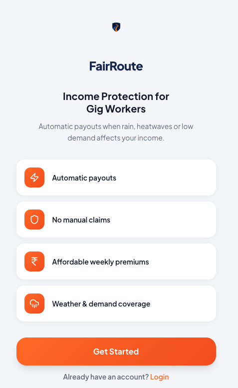 | **2. Register - Mobile Number**<br>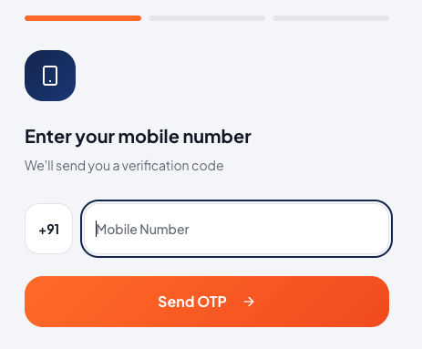 |
| **3. Register - OTP Verification**<br>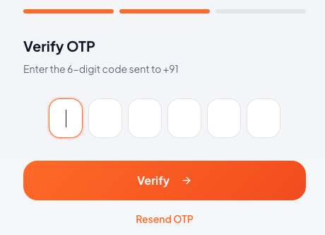 | **4. Register - Profile Details**<br>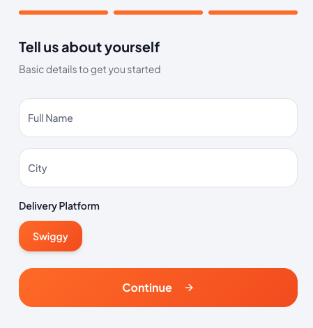 |
| **5. KYC Verification**<br>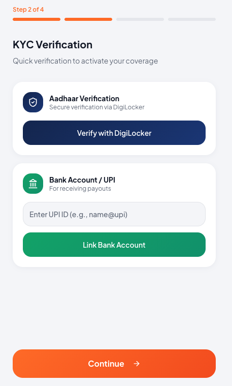 | **6. Plan Selection**<br>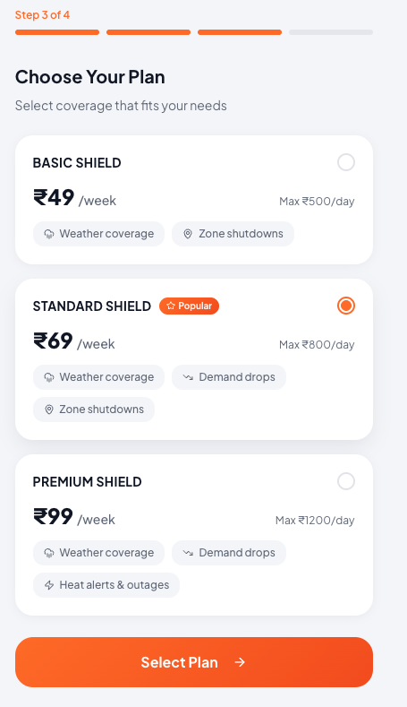 |
| **7. Home Dashboard**<br>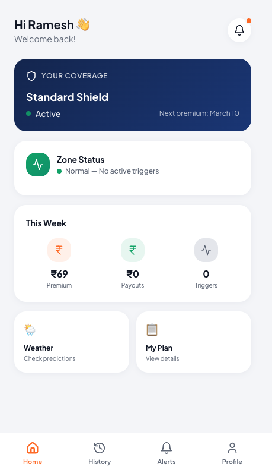 | **8. Payout History**<br>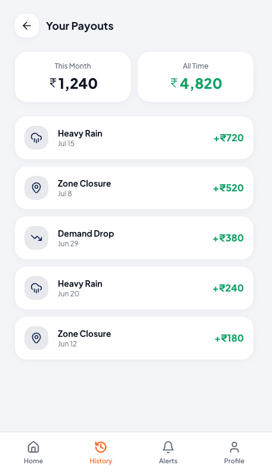 |
| **9. Payout Details**<br>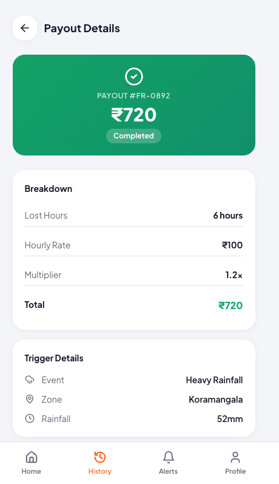 | **10. Active Trigger Alert**<br>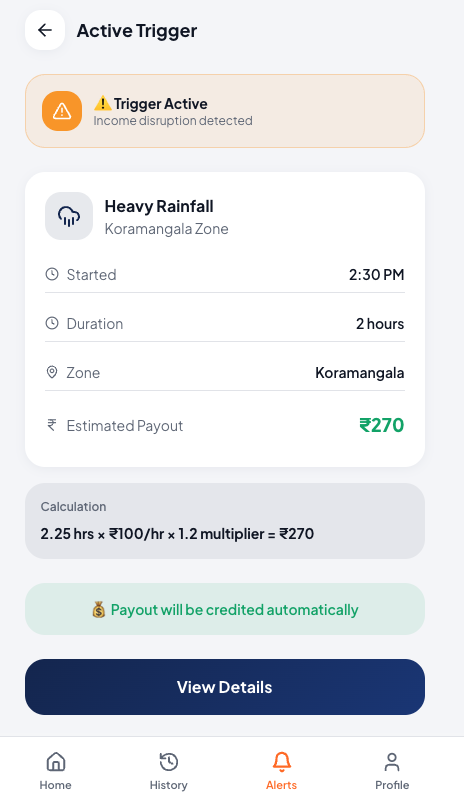 |

**11. Profile**

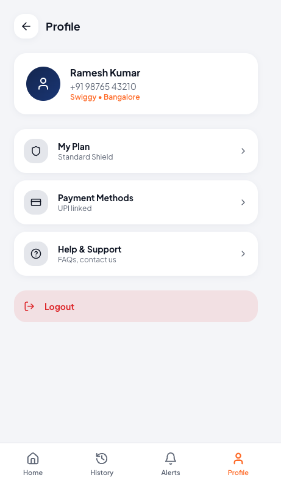

---

## Sources

### Primary Research Sources

| Source | Topic | Link |
|--------|-------|------|
| Harvard Business Review | Gig Work & Extreme Weather | [HBR Article](https://hbr.org) |
| Inc42 | Gig Economy Report | [Inc42 Report](https://inc42.com) |
| Economic Times | Gig Economy Algorithm Transparency | [ET Article](https://economictimes.com) |
| Fairwork India | Platform Ratings & Audits | [Fairwork Report](https://fair.work) |

---

## License

MIT License - See LICENSE file for details

---

## Contact

**FairRoute Team**

- Website: [fairroute.in](https://fairroute.in)
- Contact: Trisha Janath: trishajanath@gmail.com
- Contact: Neelesh Padmanabh: neelesh2561@gmail.com
- Contact: Ashwin Tom Shibu: ashwin.astrophilos@gmail.com
- Twitter: [@FairRouteIndia](https://twitter.com/FairRouteIndia)

---

<p align="center">
  <strong>FairRoute</strong> — Financial Security for the Gig Economy
  <br>
  <em>Protecting India's delivery workforce through AI-powered parametric insurance</em>
</p>
